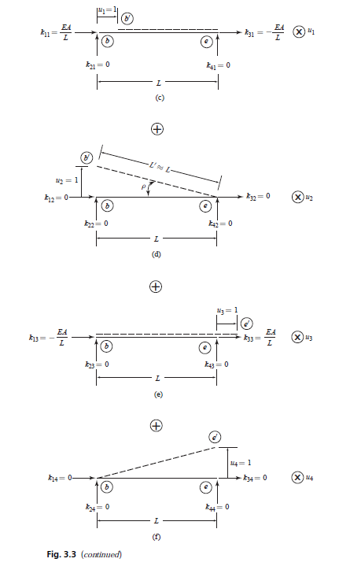

# truss

## What is this program about?
This program is about structural analysis using stiffness method. 
During learning, I tried to code the concepts of stiffness in structral analysis using the simplest structure that is 2D truss.
Unlike flexibility methods where internal forces are solved to get delfections, in stiffness method we solve for the deflections first to get internal forces.

This picture is the derivation of stiffness matrix for 2D truss:

*Notation for stiffness coefficient derivation in 2D truss elements (Kassimali, A.)*

2D truss elements have 2 degree of freedoms in each end. Therefore there is 4 degree of freedoms (u1, u2, u3, u4) in each elements (X, Y translations in each end).

This picture is the breakdown of total displacement into each displacement components (u1, u2, u3, u4):

*Stiffness coefficients derivation (Kassimali, A.)*

>kij represents the force at the location and in the direction of Qi required,
along with other end forces, to cause a unit value of displacement uj,
while all other end displacements are zero. These forces per unit displacement
are called stiffness coefficients. (Kassimali, A.)

From the figure we can get the value of $Q$ by the summation of product between $k$ and $u$ as follows:

$$\begin{eqnarray}
Q_1 = k_{11}u_1 + k_{12}u_2 + k_{13}u_3 + k_{14}u_4\\
Q_2 = k_{21}u_1 + k_{22}u_2 + k_{23}u_3 + k_{24}u_4\\
Q_3 = k_{31}u_1 + k_{32}u_2 + k_{33}u_3 + k_{34}u_4\\
Q_4 = k_{41}u_1 + k_{42}u_2 + k_{43}u_3 + k_{44} u_4\\
\end{eqnarray}$$

or in a matrix form as folllows:

$$\begin{bmatrix}
Q_1\\
Q_2\\
Q_3\\
Q_4
\end{bmatrix} = \begin{bmatrix}
k_{11} & k_{12} & k_{13} & k_{14}\\
k_{21} & k_{22} & k_{23} & k_{24}\\
k_{31} & k_{32} & k_{33} & k_{34}\\
k_{41} & k_{42} & k_{43} & k_{44} 
\end{bmatrix}
\begin{bmatrix}
u_1\\
u_2\\
u_3\\
u_4
\end{bmatrix}$$

<!--
$$\begin{array}{ccc}
x_{11} & x_{12} & x_{13}\\
x_{21} & x_{22} & x_{23}
\end{array}$$
$$f(k) = {n \choose k} p^{k} (1-p)^{n-k}$$
$$f(k) = {n \choose k} p^{k} (1-p)^{n-k}$$
\[\begin{align*}2x -12 &= 4\\@lhs(sol)@ &= @rhs(sol)@ \end{align*}\]

$$\phant
-->
## Input
- joint data
- support data
- material property data
- cross-sectional property data
- member data
- load data

## Output
- displacements
- member end forces

## What things that I learned during the process?
- How structural analysis is done with computer modeling.
- Creating a simple applications to calculate structural responses from scratch.
- Understanding the program complexity in terms of space and time, $O(NDOF^2)$, where $NDOF$ is number of degree of freedom for a simple linear analysis.
- Understanding this simple problem serves as the foundation to know for more generalized problems (3D frames) which has 6 degree of freedoms (X, Y, Z translations and rotations) in each end of the members. The stiffness coefficient is given below:

$$k = \frac{E}{L^3}
\begin{bmatrix}
AL^2 & 0 & 0 & 0 & 0 & 0 & −AL^2 & 0 & 0 & 0 & 0 & 0\\
0 & 12I_z & 0 & 0 & 0 & 6LI_z & 0 & −12I_z & 0 & 0 & 0 & 6LI_z\\
0 & 0 & 12I_y & 0 & −6LI_y & 0 & 0 & 0 & −12I_y & 0 & −6LI_y & 0\\
0 & 0 & 0 & \frac{GJL^2}{E} & 0 & 0 & 0 & 0 & 0 & \frac{-GJL^2}{E}& 0 & 0\\
0 & 0 & −6LI_y & 0 & 4L^2I_y & 0 & 0 & 0 & 6LI_y & 0 & 2L^2I_y & 0\\
0 & 6LI_z & 0 & 0 & 0 & 4L^2I_z & 0 & −6LI_z & 0 & 0 & 0 & 2L^2I_z\\
−AL^2 & 0 & 0 & 0 & 0 & 0 & AL^2 & 0 & 0 & 0 & 0 & 0\\
0 & −12I_z & 0 & 0 & 0 & −6LI_z & 0 & 12I_z & 0 & 0 & 0 & −6LI_z\\
0 & 0 & −12I_y & 0 & 6LI_y & 0 & 0 & 0 & 12I_y & 0 & 6LI_y & 0\\
0 & 0 & 0 & \frac{-GJL^2}{E} & 0 & 0 & 0 & 0 & 0 & \frac{GJL^2}{E} & 0 & 0\\
0 & 0 & −6LI_y & 0 & 2L^2I_y & 0 & 0 & 0 & 6LI_y & 0 & 4L^2I_y & 0\\
0 & 6LI_z & 0 & 0 & 0 & 2L^2I_z & 0 & −6LI_z & 0 & 0 & 0 & 4L^2I_z
\end{bmatrix}$$

where:

$$\begin{eqnarray}
\large L &=& member \enspace length\\
\large A &=& cross \enspace sectional \enspace area\\
\large E &=& modulus \enspace of \enspace elasticity\\
\large G &=& shear \enspace modulus\\
\large J &=& torsion \enspace constant\\
\large I_y &=& moment \enspace of \enspace inertia \enspace y-y\\
\large I_z &=& moment \enspace of \enspace inertia \enspace z-z\\
\end{eqnarray}$$

## Resources
Kassimali, A., 2012. *Matrix analysis of structures*. 2nd ed. Stamford: Cengage Learning.